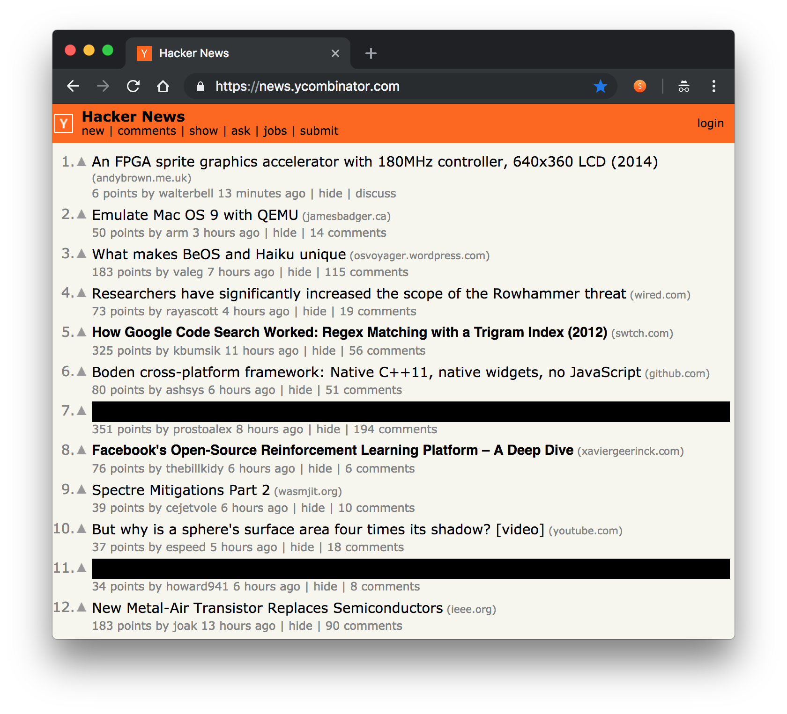

#  Sieve for Hacker News
A chrome extension to hide and highlight articles on the frontpage based on
selected keywords.

- 🤓 Quickly skim and find articles of interest
- 😌 Gives you peace of mind; avoid triggering or noisy articles

